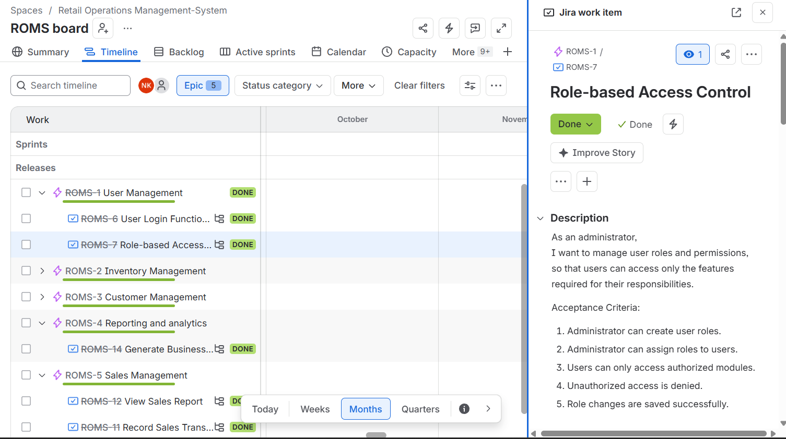
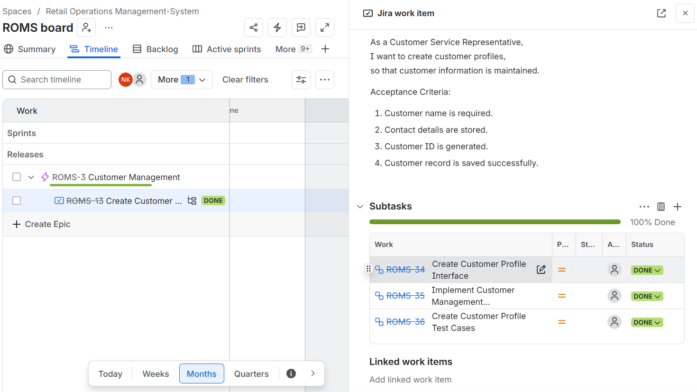
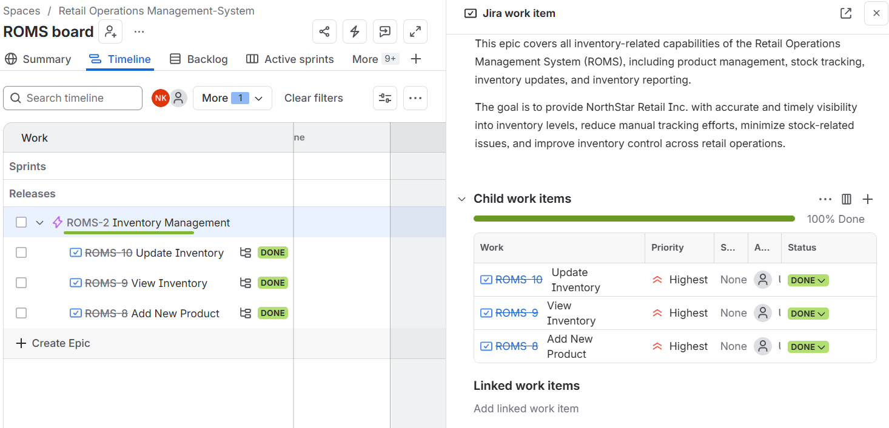

# Retail Operations Management System (ROMS)

## Business Analysis Portfolio Project


---

## Project Overview

The **Retail Operations Management System (ROMS)** is a Business Analysis portfolio project developed for **NorthStar Retail Inc.** The project demonstrates the complete Business Analysis lifecycle, from business requirements gathering through functional analysis, Agile planning, UML modeling, wireframing, testing, and project documentation.

The objective of the project is to streamline retail operations by improving inventory management, sales processing, customer management, and business reporting.

---

# Business Problem

The organization relied on manual processes for inventory management and sales tracking, resulting in:

- Inventory inaccuracies
- Delayed business reporting
- Manual sales recording
- Inefficient customer management
- Limited operational visibility

---

# Proposed Solution

Develop a centralized Retail Operations Management System that supports:

- Secure User Authentication
- Inventory Management
- Sales Transactions
- Customer Management
- Business Reporting
- Role-Based Access Control

---

# Business Analysis Deliverables

## Requirements Documentation

- [Business Case](Retail-Operations-Management-System/Business_Case/business_case.md)
- [Stakeholder Analysis](Retail-Operations-Management-System/Stakeholders/stakeholders_analysis.md)
- [Business Requirements Document (BRD)](Retail-Operations-Management-System/Business_Requirements/business_requirements_document.md)
- [Functional Requirements Document (FRD)](Retail-Operations-Management-System/Functional_Requirements/functional_requirements_document.md)
- [User Stories & Acceptance Criteria](Retail-Operations-Management-System/User_Stories/user_stories.md)
- [Requirements Traceability Matrix (RTM)](Retail-Operations-Management-System/Requirements_Traceability_Matrix/RTM.md)

---

## Agile Documentation

- Product Backlog
- Sprint Planning
- Sprint Retrospectives
- Jira Board Management

---

## UML Models

- Use Case Diagram
- Domain Class Diagram
- Activity Diagram – Record Sales Transaction
- Activity Diagram – Update Inventory

---

## Wireframes

- Login Page
- Dashboard
- Inventory Management
- Sales Transaction
- Customer Profile
- Reports Dashboard

---

## Testing

- Test Plan
- User Acceptance Test (UAT) Cases

---

## Technical Documentation

- REST API Documentation

---

# Repository Structure

```text
Business-Analysis-Portfolio/
│
├── README.md
│
└── Retail-Operations-Management-System/
    │
    ├── API_Documentation/
    ├── Business_Case/
    ├── Business_Requirements/
    ├── Final_Report/
    ├── Functional_Requirements/
    ├── Project_Overview/
    ├── Requirements_Traceability_Matrix/
    ├── Screenshots/
    ├── Sprint_Planning/
    ├── Sprint_Retrospectives/
    ├── Stakeholders/
    ├── Testing/
    ├── UML_Diagrams/
    ├── Use_Cases/
    ├── User_Stories/
    └── Wireframes/
---
---

# Tools Used

| Category | Tool |
|-----------|------|
| Requirements Documentation | Markdown |
| Agile Project Management | Jira |
| UML Modeling | Mermaid, Draw.io, Visual Paradigm |
| Wireframing | Visual Paradigm |
| Version Control | Git |
| Repository Hosting | GitHub |

---

# Key Features

- User Authentication
- Role-Based Access Control
- Product Management
- Inventory Tracking
- Sales Processing
- Customer Management
- Sales Reports
- Business Reports

---

# Skills Demonstrated

This project demonstrates practical experience in:

- Business Requirements Analysis
- Functional Requirements Documentation
- Stakeholder Analysis
- User Story Writing
- Agile (Scrum)
- Jira
- UML Modeling
- Activity Diagrams
- Domain Modeling
- Wireframing
- Requirements Traceability
- REST API Documentation
- Test Planning
- User Acceptance Testing (UAT)
- Git & GitHub

---

## Screenshots

### Jira Timeline



### Jira Epic Customer_Management



### Jira Epic Inventory_Management



---
# Future Enhancements

Potential future enhancements include:

- Barcode Integration
- Supplier Management
- Purchase Order Management
- Email Notifications
- Mobile Application
- Business Intelligence Dashboard

---

# About This Portfolio

This project was created to demonstrate practical Business Analysis skills using industry-standard documentation, Agile practices, UML modeling, and software requirements engineering techniques.

It represents an end-to-end Business Analysis project suitable for showcasing during interviews for Business Analyst, Systems Analyst, and Application Analyst positions.

---

**Author:** Nagma 
